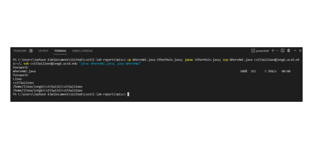

# Lab Report 1 Week 2

# Tutorial for how to log into a course-specific account on ieng6

## 1. Installing VScode

Go to the Visual Studio Code website to download VScode [https://code.visualstudio.com/](https://code.visualstudio.com/)


This is what my VScode looks like.

---

## 2. Remotely connecting

First, install OpenSSH, which allows you to connect to the UCSD servers: [OpenSSH](https://docs.microsoft.com/en-us/windows-server/administration/openssh/openssh_install_firstuse)

I'm on Windows 10 so I just followed the instructions on the link above.


Next, look up your course specific account for CSE15L at this link: 

[Course specific link](https://sdacs.ucsd.edu/~icc/index.php)

I had a lot of problems finding my login info and then trying to connect to the server from here though -- if this happens, you may need to reset your password (I did this three times before getting positive results).


Your account should start with `cs15lwi22`. Now go open up a terminal in VScode, and connect to the remote server by typing `ssh cs15lwi22abc@ieng6.ucsd.edu` into the terminal, where `abc` is your specific account. 

Hopefully, you should get something like this after typing in your password:

 

If you get a message asking about authenticity, just say yes.

**NOTE:** I had an error that was apparently pretty common, where when typing in my password it wouldn't go through 3 times. Then it would ask for the password to the server, and after a few more tries it would not connect. I'm not sure what the solution is but it was fixed after a day of changing my password.

---

## 3. Trying some commands


* In this screenshot I included some of the recommended trial commands
    * `ls`
    * `ls -a` (which shows hidden items)
    * `mkdir`
    * `cp`
* Unfortunately I don't think I have access to the file that was given in the example for `cp`, but `cp` works on the command line on my local directory on my computer.

---

## 4. Moving files with `scp`

First, I made `WhereAmI.java` on my computer.


This was the result of running the program:


Then, I securely copied it to the remote server by using the command:

`scp WhereAmI.java cs15lwi22axv@ieng6.ucsd.edu:~/`

then ran it on the remote server.


As you can see, it has different results because it is returning different values for the program based on the operating system and the username.

---

## 5. Setting an SSH key

For this step, I was succcessful in generating a key and making a `.ssh` directory in the remote server:


However, I tried to follow the steps to securely copy my public key to the server in the file `authorized_keys`, but it didn't work. I also tried to follow the Windows instructions for `ssh-add` [at this link to securely store my key](https://docs.microsoft.com/en-us/windows-server/administration/openssh/openssh_keymanagement#user-key-generation) but that also didn't seem to work despite being on command prompt as an admin:


---

## 6. Optimizing remote running

Since I couldn't figure out how to get my ssh key working in time for this, I still had to type out my password. 

The simplest, one-line command that I found that saves my work locally then copies it to the remote server and runs it was this:



This is the full line broken down into parts:

```
cp WhereAmI.java OtherMain.java;
javac OtherMain.java;
scp WhereAmI.java cs15lwi22axv@ieng6.ucsd.edu:~/;
ssh cs15lwi22axv@ieng6.ucsd.edu "javac WhereAmI.java; java WhereAmI"
```

`cp WhereAmI.java OtherMain.java;`
* Copies the file to a save file locally
    
`javac OtherMain.java;`
* Compiles the save file

`scp WhereAmI.java cs15lwi22axv@ieng6.ucsd.edu:~/;`
* Copies the file to the remote server

`ssh cs15lwi22axv@ieng6.ucsd.edu "javac WhereAmI.java; java WhereAmI"`
* Connects to the remote server, and compiles and runs the file

Overall, compressing this entire process into one line removes 3 keystrokes: one from each line that is added to the long single command.