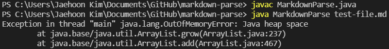
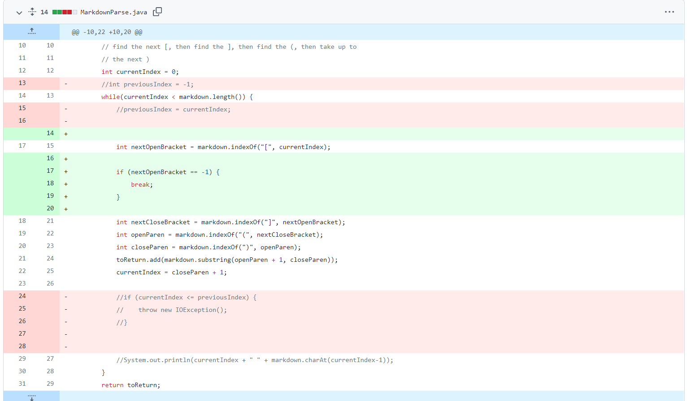
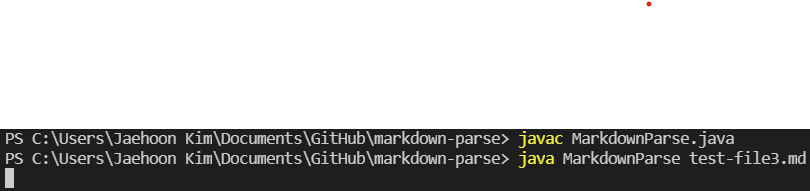

# Lab Report 2 Week 4

# Debugging

## BugFix 1

**Bug:** 

[Link to the failure inducing input text file](misc/text-file.java)

**Symptom:**

**GitHub change:**

If the file did not end with a valid link, the code infinitely looped. This is shown by the symptom because it runs out of memory for a simple program because it keeps adding the same links to the `getLinks` method. This is solved by breaking the loop if it returns to the beginning.

---

## BugFix 2

**Bug:**

[Link to the second failure inducing input text file](misc/text-file3.java)

**Symptom:**

**GitHub change:**

When the file contained an extra `[]` after the last valid link, the code infinitely looped. In this particular case it never adds anything to the array of links, which is why the symptom doesn't show running out of memory as an issue. This is solved by breaking the loop if any of the brackets or parenthese returns to the beginning, instead of just the first open bracket.

---

## BugFix 3

**Bug:**

[Link to the third failure inducing input text file](misc/text-file4.java)

**Symptom:**

**GitHub change:**

