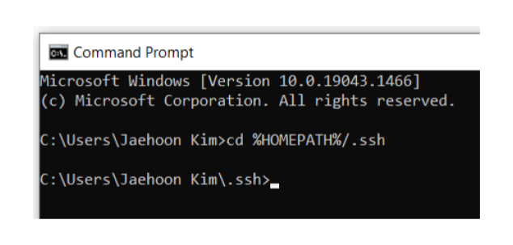
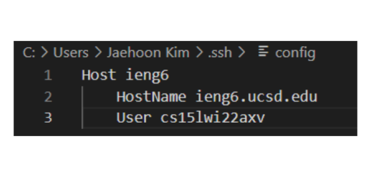
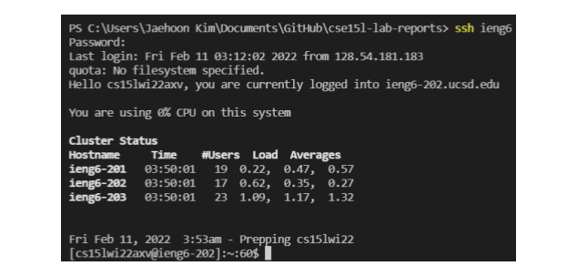
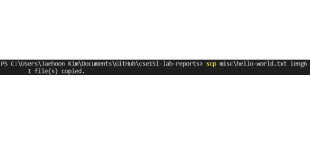

# Lab Report 3 Week 6

# Streamlining ssh Configuration

## 1. Showing .ssh/config File And How I Edited It

**Finding the root directory and the .ssh folder**

**Editing Config File**

I opened up the config file in VScode and made the changes.

---

## 2. Logging in using ssh

**Login**

---

## 3. scp Command Copying A File Using ssh

**scp**

Screenshot from the command that securely copied using the alias

