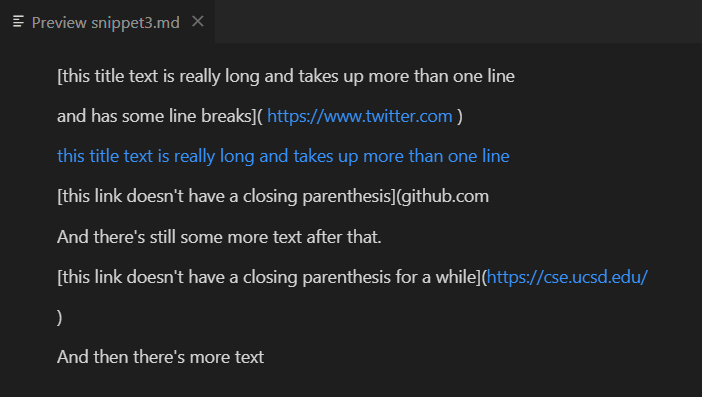

# Lab Report 4 Week 8

# Debugging

## Snippet 1

**What it should produce:** 

Original snippet on the left and expected output on the right, using [the CommonMark demo site](https://spec.commonmark.org/dingus/).

**MarkdownParseTest:**

**My implementation:**

**Reviewed implementation:**

---

## Snippet 2

**What it should produce:** 

**MarkdownParseTest:**

**My implementation:**

**Reviewed implementation:**

---

## Snippet 3

**What it should produce:** 

**MarkdownParseTest:**

**My implementation:**

**Reviewed implementation:**

