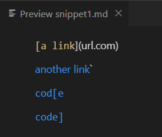

# Lab Report 4 Week 8

# Debugging

## 1. Snippet 1

**What it should produce:** 

Original snippet on the left and expected output on the right, using [the CommonMark demo site](https://spec.commonmark.org/dingus/), as well as the output using preview in VScode.

**MarkdownParseTest:**

I made a test for this by asserting that the expected links and the output of `MarkdownParse.getLinks()` would be the same.

**My implementation output:**

My implementation didn't pass for [snippet 1](misc/snippet1.md). 

**Reviewed implementation:**

**My thoughts on code changes to deal with backticks**

I think that solving backticks in links would require a relatively large change to the code because the way backticks behaves in links is different for brackets and parentheses.

For example, brackets inside backticks must be ignored and not treated as part of a link but parentheses inside backticks should be taken into account.

To solve this I would have to first check for backticks, and whether or not to include brackets inside it as part of a link.

---

## 2. Snippet 2

**What it should produce:** 

**MarkdownParseTest:**

I made a test for this by asserting that the expected links and the output of `MarkdownParse.getLinks()` would be the same.

**My implementation output:**

My implementation didn't pass for [snippet 2](misc/snippet2.md). 

**Reviewed implementation:**

**My thoughts on dealing with nested and escaped parentheses and brackets**

I think that escaped parentheses and brackets would be a small change that could be implemented, but not nested ones.

Solving nested ones would be much more difficult because if it was intended not to be a nested parenthesis or bracket, singular ones would ruin the code because it would be checking for groups of closed parentheses and brackets.

To solve escaped parentheses and brackets I would have to ignore parentheses and brackets that are immediately preceded by a single backslash from being treated as part of a link.

---

## 3. Snippet 3

**What it should produce:** 

**MarkdownParseTest:**

I made a test for this by asserting that the expected links and the output of `MarkdownParse.getLinks()` would be the same.

**My implementation output:**

My implementation didn't pass for [snippet 3](misc/snippet3.md). 

**Reviewed implementation:**

**My thoughts on newlines and spaces in links**

I think getting my program to deal with newlines and spaces would only require a small code change.

I specifically designed my parser to ignore links that had spaces in them, so I think I'd only have to remove that aspect from my code and make slight adjustments as necessary.