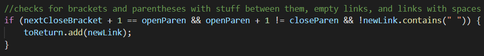
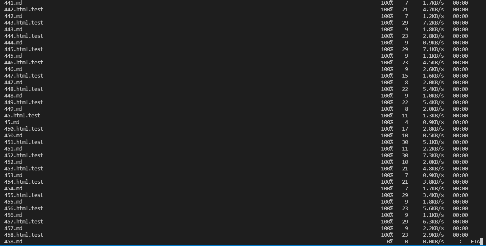

# Lab Report 5 Week 10

# Comparing Two Implementations

---

## 1. My implementation

First, I ran the bash for loop script of my `MarkdownParse.java` file remotely and saved it to the file `./MyMarkdownParseWeek9/my-results.txt`.

## 2. The other implementation

Next, I ran the bash for loops script on the other provided `MarkdownParse.java` file remotely and saved it to the file `./Markdown-Parse-Week-9/results.txt`.

## 3. The differences

In order to find the differences between these two outputs, I ran `diff` on them.

It goes on for a little bit longer, but it didn't fit on my screen.

## 4. Analysis

The first difference to look at is the first one. The result of using the `diff` command would suggest that the result of the provided implementation resulted in `"[url]"`, while my implementation found no valid links.

Line 212 of the resulting files were different here, so after checking line 212 and finding that it was `194.md` that caused the problem I ran them separately.

Provided:

Mine:

Given the actual data in [the 194.md file](https://github.com/hungrypingu/markdown-parse/test-files/194.md), this is the expected outcome of the links parsed using CommonMark (which I wrote code for that I will get to later):

The issue here is that neither mine nor the code provided accounts for markdown that includes metadata for the link, like "title" in this case, which is text that is supposed to show up when you hover over the link. As for the code that should be fixed, something that solves metadata in links needs to be completely added from scratch since it is completely nonexistent in both implementations.

There needs to be some code added here that searches for metadata in between the brackets and parentheses, while mine only checks for empty spaces and instantly disregards the link if it contains extraneous characters in those spots.

For the provided implementation the additional code to account for metadata in the links should probably go somewhere here, where it checks for the parentheses after the brackets.

---

The second difference that I chose is one corresponding to the result of line 916 of parsing using the provided code and line 918 of my own code, which was also the test in `510.md`:

I once again ran them separately.

Provided:

Mine:

Given the actual data in [the 510.md file](https://github.com/hungrypingu/markdown-parse/test-files/510.md), this is the expected outcome of the links parsed using my CommonMark, modified to show the links:

My output has the same output as the expected result, which is no links. This particular problem is evident in the provided code because it doesn't account for spaces between the different brackets in the link syntax. 

The above provided implementation simply grabs the next following open parenthese after the closed bracket, whereas mine accounts for it:

---

## My Big Fail (that I thought was worth mentioning here)

**CommonMark Implementation**

Initially I thought I was supposed to find the differences between my implementation and the given CommonMark implementation. As it turns out, I think my 

I ran into a pretty frustrating issue with the classpath on my windows machine. Despite having the necessary source files in the classpath and my `lib/` folder, I was unable to compile the example code from `TryCommonMark`. 

This is the same file that I used: [My TryCommonMark file](https://github.com/hungrypingu/markdown-parse/TryCommonMark.java).

As you can see, for whatever reason the computer can't seem to find the appropriate source files.

However, it seems to successfully compile and run when I click the run button on VSCode.

I modified the code from the lab to take the links from a `.md` file and it had the same outcome where it would fail to compile via terminal because it can't find source files, but work when run using the button on VSCode.

Above is the outcome for terminal input, and below is the output for just running it. 

First, it says build failed, but upon clicking proceed the correct output is shown.

I also tried securely copying my sort-of working CommonMark file to the remote server along with the `lib/` files, but it also gave similar compilation errors, so I couldn't figure out a good way to run the bash script on it via remote server. It required an argument to the java file in order to compile, and the only way I could get it to compile was using the button on VSCode that I didn't have on the remote server anymore.

As a result, I securely copied the `test-files` directory and `script.sh` from the remote server to my local directory.

It took a lot of googling but I modified the code to do the script part, since the script couldn't compile it with an argument (still unsure why). [Here is the link to the code itself, including all the messy stuff and debugging.](https://github.com/hungrypingu/markdown-parse/CommonMarkdownParse.java)

The end result of this is [a text file that has (I hope) all the expected outcomes of using CommonMark](https://github.com/hungrypingu/markdown-parse/my-results.txt) to differentiate links in markdown.
