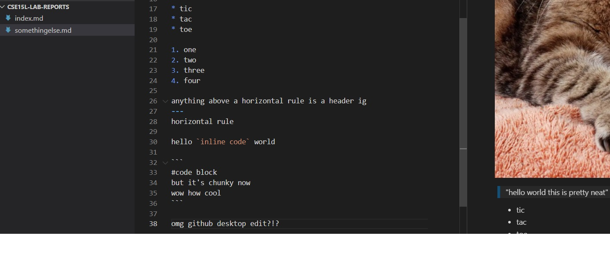

not index.html

*italicized words*

**now they're bold**

# dope header #
## another dope header ##

[Link](https://hungrypingu.github.io/cse15l-lab-reports/somethingelse.html)
[Link][1]
⋮
[1]: https://hungrypingu.github.io/cse15l-lab-reports/somethingelse.html


>"hello world
>this is pretty neat"

* tic
* tac
* toe

1. one
2. two 
3. three
4. four

anything above a horizontal rule is a header ig
---
horizontal rule

hello `inline code` world

```
#code block
but it's chunky now
wow how cool
```

omg github desktop edit?!?


